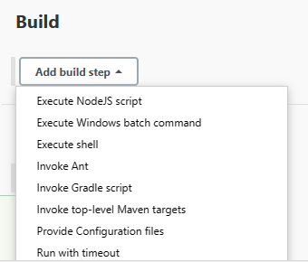
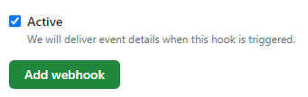

# CICD Pipeline Documentation

## Task: Implementing Continuous Integration/Continuous Deployment (CICD) Pipeline

### What is a CICD Pipeline?

A CICD pipeline is a set of automated processes that facilitate the integration of code changes into a shared repository, along with automated testing and deployment. It ensures that code changes are efficiently and consistently built, tested, and deployed to production environments.

### Why Implement a CICD Pipeline?

Implementing a CICD pipeline offers several benefits:
- **Streamlined Development:** Developers can focus on writing code while the pipeline automates building, testing, and deployment processes.
- **Faster Feedback:** Automated testing provides rapid feedback on code changes, enabling faster identification and resolution of issues.
- **Consistency:** CICD pipelines ensure consistency in the deployment process, reducing the risk of errors and inconsistencies across environments.
- **Continuous Delivery:** Enables the continuous delivery of software, allowing for rapid and reliable release cycles.

## Continuous Integration (CI)

### What is Continuous Integration (CI)?

Continuous Integration (CI) is the practice of frequently integrating code changes into a shared repository, where automated build and test processes verify the changes. It aims to detect and address integration errors early in the development cycle.

### When to Use Continuous Integration (CI)?

CI is crucial in scenarios where:
- There are multiple developers working on the same codebase.
- Code changes are frequent and need to be integrated quickly.
- Ensuring code quality and early bug detection are priorities.

### How to Implement Continuous Integration (CI)?

#### Step 1: Source Control
- Set up a version control system (e.g., Git) to manage code changes.

#### Step 2: Automated Builds
- Configure automated build processes using build tools like Jenkins, Travis CI, or GitLab CI.

#### Step 3: Automated Testing
- Implement automated testing suites for unit tests, integration tests, and end-to-end tests.

## Continuous Deployment (CD)

### What is Continuous Deployment (CD)?

Continuous Deployment (CD) is the practice of automatically deploying code changes to production or other environments after passing through the CI process. It aims to automate the deployment process and ensure rapid delivery of software.

### When to Use Continuous Deployment (CD)?

CD is essential in scenarios where:
- Rapid and frequent deployment of code changes is required.
- Ensuring minimal manual intervention in the deployment process is a priority.
- Continuous delivery of features and updates to end-users is desired.

### How to Implement Continuous Deployment (CD)?

#### Step 4: Deployment Automation
- Define deployment scripts and automation workflows for deploying applications to various environments (development, staging, production).

#### Step 5: Monitoring and Feedback
- Integrate monitoring and alerting tools to monitor the health and performance of deployed applications.
- Collect feedback from users and system metrics to continuously improve the pipeline.

### CICD Pipeline Diagram

The diagram illustrates the flow of code changes through various stages of the CICD pipeline, including source control, automated builds, testing, and deployment.

Master Server - Jenkins

## CICD Job

### Steps to create the Jenkins Job

1. Click 'New Item'

2. Enter name

3. Select Freestyle project

4. Enter description

5. Enable GitHub and input URl

6. Enable Restict where this project can be run and input "sparta-ubuntu-node"

7. Enable Git for Source Code Management and input Repository URL

8. Input Private Key

9. Change to */main branch

10. In Build Envrionment, Enable Provide Node & npm bin/ folder to PATH

11. Click Add build step in Build

12. Then Click "Execute shell"

13. Input the Command Into the execute shell

14. Then click Save and Apply

15. Run Build and check console output

## Adding A Web Hook

1. First, Go to "Build Triggers" in Jenkins and enable "GitHub hook trigger for GITScm polling"

2. Navigate to the GitHub Repo

3. Click "Settings"

4. Click Webhooks

5. Click "Add webhook"

6. For Payload URL input `http://3.9.14.9:8080/github-webhook/`

7. Change Content Type to "application/json"

8. Enable "Let me select individual events"

9. Enable Pull requests and Pushes

10. Make sure Active is enabled and click Add webhook

11. Make a change and push the change to the Github Repo

12. Check the build history on jenkins for a new build

