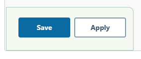
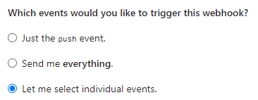
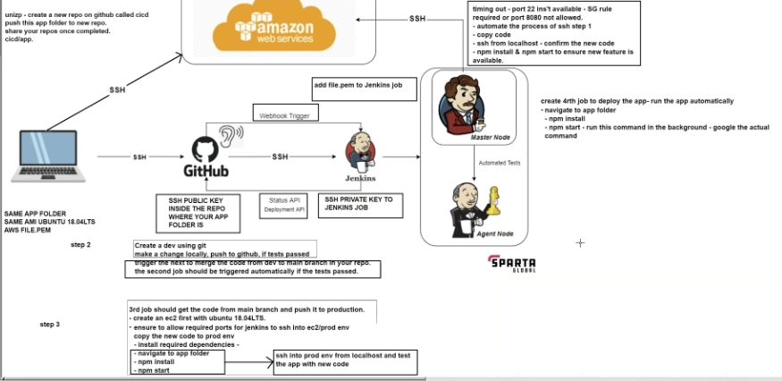
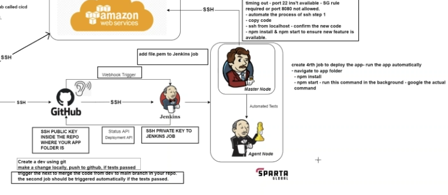
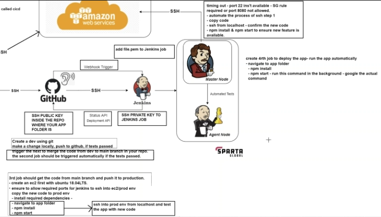

# CICD Pipeline Documentation

## Task: Implementing Continuous Integration/Continuous Deployment (CICD) Pipeline

### What is a CICD Pipeline?

A CICD pipeline is a set of automated processes that facilitate the integration of code changes into a shared repository, along with automated testing and deployment. It ensures that code changes are efficiently and consistently built, tested, and deployed to production environments.

### Why Implement a CICD Pipeline?

Implementing a CICD pipeline offers several benefits:
- **Streamlined Development:** Developers can focus on writing code while the pipeline automates building, testing, and deployment processes.
- **Faster Feedback:** Automated testing provides rapid feedback on code changes, enabling faster identification and resolution of issues.
- **Consistency:** CICD pipelines ensure consistency in the deployment process, reducing the risk of errors and inconsistencies across environments.
- **Continuous Delivery:** Enables the continuous delivery of software, allowing for rapid and reliable release cycles.

## Continuous Integration (CI)

### What is Continuous Integration (CI)?

Continuous Integration (CI) is the practice of frequently integrating code changes into a shared repository, where automated build and test processes verify the changes. It aims to detect and address integration errors early in the development cycle.

### When to Use Continuous Integration (CI)?

CI is crucial in scenarios where:
- There are multiple developers working on the same codebase.
- Code changes are frequent and need to be integrated quickly.
- Ensuring code quality and early bug detection are priorities.

### How to Implement Continuous Integration (CI)?

#### Step 1: Source Control
- Set up a version control system (e.g., Git) to manage code changes.

#### Step 2: Automated Builds
- Configure automated build processes using build tools like Jenkins, Travis CI, or GitLab CI.

#### Step 3: Automated Testing
- Implement automated testing suites for unit tests, integration tests, and end-to-end tests.

## Continuous Deployment (CD)

### What is Continuous Deployment (CD)?

Continuous Deployment (CD) is the practice of automatically deploying code changes to production or other environments after passing through the CI process. It aims to automate the deployment process and ensure rapid delivery of software.

### When to Use Continuous Deployment (CD)?

CD is essential in scenarios where:
- Rapid and frequent deployment of code changes is required.
- Ensuring minimal manual intervention in the deployment process is a priority.
- Continuous delivery of features and updates to end-users is desired.

### How to Implement Continuous Deployment (CD)?

#### Step 4: Deployment Automation
- Define deployment scripts and automation workflows for deploying applications to various environments (development, staging, production).

#### Step 5: Monitoring and Feedback
- Integrate monitoring and alerting tools to monitor the health and performance of deployed applications.
- Collect feedback from users and system metrics to continuously improve the pipeline.

### CICD Pipeline Diagram


The diagram illustrates the flow of code changes through various stages of the CICD pipeline, including source control, automated builds, testing, and deployment.

Master Server - Jenkins

## Setting up a CI/CD Job in Jenkins

### Introduction

This guide outlines the steps to create a Continuous Integration/Continuous Deployment (CI/CD) job in Jenkins and configure GitHub webhooks for automated builds.

### Master Node:

1. **Centralized Control**: The Master node is the central server in a Jenkins environment. It manages the configuration settings, job scheduling, and monitors the entire Jenkins system.

2. **Job Distribution**: It receives requests from users or external systems to execute tasks (jobs) and distributes these tasks to available Agent nodes for execution.

3. **User Interface**: The Jenkins web interface, where users can configure jobs, view build results, and manage plugins, is typically accessed through the Master node.

4. **Executor**: The Master node also executes some jobs directly, especially those that don't require a specific environment or can't be delegated to Agent nodes.

5. **Primary Configuration**: It holds the primary configuration of Jenkins, including global settings, user permissions, and plugin configurations.

6. **Resource Management**: It manages resources such as disk space and memory, ensuring optimal performance and resource allocation across the Jenkins environment.

### Agent Node:

1. **Worker Nodes**: Agent nodes, also known as worker nodes or slave nodes, are additional machines configured to offload build and test tasks from the Master node.

2. **Distributed Builds**: They execute jobs delegated by the Master node, allowing for distributed builds across multiple machines. This helps in scaling Jenkins to handle larger workloads efficiently.

3. **Specialized Environments**: Agent nodes can be configured with specific software environments, tools, or hardware configurations required for particular builds or tests.

4. **Parallel Execution**: Multiple Agent nodes can execute jobs concurrently, enabling parallel execution of builds and reducing overall build times.

5. **Isolation**: Each Agent node operates independently, providing isolation between different builds and ensuring that failures in one job don't affect others.

6. **Scalability**: Additional Agent nodes can be added or removed dynamically based on workload demands, providing scalability to the Jenkins environment.

## CICD Job

A Jenkins job, also known as a build job or pipeline, is a task or set of tasks that Jenkins executes as part of a continuous integration (CI) or continuous deployment (CD) process. These jobs define the steps needed to build, test, deploy, and deliver software applications automatically.

Here's what a Jenkins job typically consists of:

1. **Source Code Checkout**: The job starts by checking out the source code from a version control system like Git, Subversion, or Mercurial.
2. **Build Process**: Jenkins performs various build tasks, such as compiling code, running unit tests, and generating artifacts like JAR files or Docker images.
3. **Testing**: The job executes automated tests, including unit tests, integration tests, and any other types of tests necessary to ensure the quality of the software.
4. **Deployment**: For CD pipelines, Jenkins may deploy the built artifacts to various environments, such as development, staging, or production servers.
5. **Notification**: Jenkins sends notifications to relevant stakeholders about the build status, test results, and deployment status via email, Slack, or other communication channels.
6. **Reporting**: Jenkins generates reports on build and test results, providing insights into the health and quality of the software.
7. **Logging and Monitoring**: Jenkins logs build output and provides monitoring capabilities to track the progress and performance of jobs.

Jenkins jobs can be configured using Jenkins' web interface or by defining pipeline scripts using Jenkinsfile, which allows for more complex and flexible automation workflows. Jobs can be triggered manually, periodically, or automatically based on events such as code commits, pull requests, or scheduled intervals.

### Steps to Create the Jenkins Job

1. **Click 'New Item'**: Create a new item in Jenkins for the CI/CD job.
   

2. **Enter name**: Provide a name for the job.
   

3. **Select Freestyle project**: Choose the type of project, in this case, a Freestyle project.
   

4. **Enter description**: Optionally, provide a description for the job.
   

5. **Enable GitHub and input URL**: Enable GitHub integration for the job and input the URL of the GitHub repository.
   

6. **Enable Restrict where this project can be run and input "sparta-ubuntu-node"**: Configure the job to run on a specific node, in this case, "sparta-ubuntu-node".
   

7. **Enable Git for Source Code Management and input Repository URL**: Configure Git as the source code management system and input the URL of the Git repository.
   

8. **Input Private Key**: Provide the private key for authentication with the Git repository.
   

9. **Change to */main branch**: Specify the branch of the repository to build, typically the main branch.
   

10. **In Build Environment, Enable Provide Node & npm bin/ folder to PATH**: Configure the environment to include the Node.js and npm binary folders in the PATH.
    

11. **Click Add build step in Build**: Add a build step to the job.
    
    

12. **Then Click "Execute shell"**: Select the "Execute shell" build step.
    
    

13. **Input the Command Into the execute shell**: Enter the shell commands to be executed as part of the build process.
    

    **Commands:**
```bash
cd app
npm install
npm test
```
14. **Then click Save and Apply**: Save the job configuration changes.

    

15. **Run Build and check console output**: Run the build job and review the console output for any errors or issues.
    

### Adding A Web Hook

1. **First, Go to "Build Triggers" in Jenkins and enable "GitHub hook trigger for GITScm polling"**: Configure Jenkins to trigger builds automatically whenever changes are pushed to the GitHub repository.
    

2. **Navigate to the GitHub Repo**.

3. **Click "Settings"**: Enter the repository settings.
    

4. **Click Webhooks**: Navigate to the Webhooks section.
    

5. **Click "Add webhook"**: Add a new webhook for the repository.
    

6. **For Payload URL input `http://3.9.14.9:8080/github-webhook/`**: Specify the Jenkins webhook URL for GitHub to send payload data.
    

7. **Change Content Type to "application/json"**: Configure the webhook to send payload data in JSON format.
    

8. **Enable "Let me select individual events"**: Choose specific events to trigger the webhook.
    

9. **Enable Pull requests and Pushes**: Select the events that should trigger the webhook, such as pull requests and pushes.
    

10. **Make sure Active is enabled and click Add webhook**: Activate the webhook and save the configuration.
    

11. **Make a change and push the change to the Github Repo**.

12. **Check the build history on Jenkins for a new build**: Verify that Jenkins triggers a new build in response to the webhook event.
    

## Why Jenkins


## CICD Pipeline

### CI -

#### CICD Task Diagram


These 2 jobs are the CI section for the CICD Pipeline. Ensuring the Dev branch as a working build and then merging that working build with the main branch.

#### Job 1 - name-ci
This job will test NPM on the dev branch.




This job will test NPM on the dev branch.

**Plan:**
- Create a dev branch with git 
- Make a change locally and push to GitHub
- This job will test NPM on the dev branch.
- This job should trigger due to webhook 

**Steps:** 
1. Create Job
2. Input Description
3. Input Github Project
4. Restrict where this project can be run
5. Select Git in Source Code Management
6. Input Repository Url
7. Input Credentials (Private Key)
8. Specify the dev branch
9. In "Build Triggers" activate GitHub hook trigger for GITScm polling
10. In "Build Environment" activate Provide Node & npm bin/ folder to PATH
11. In "Build", Click Add and Execute shell
12. Input these commands
```bash
cd app
npm install
npm test
```
13. For now we will leave the Post build empty however in Job 2 we will come back and select Job 2 once it has been created.

#### Job 2 - name-ci-merge



This job will take the dev branch and Merge with main once job 1 is successfully built.

**Plan:**
- Input Github details
- Configure Merge


**Steps:**
1. Create Job
2. Input Description
3. Input Github Project
4. Restrict where this project can be run
5. Select Git in Source Code Management
6. Input Repository Url
7. Input Credentials (Private Key)
8. Specify the dev branch
9. Click Additional Behaviours for the plugin
10. Click Merge Before build
11. Add name of repository `tech258-cicd`
12. Add Branch to merge to `main`
13. In "Build Environment" activate Provide Node & npm bin/ folder to PATH
14. Go to Job 1 and add Job 2 as the post build step

### CD -

These 2 jobs are the CD section for the CICD Pipeline.

#### Job 3 - name-cd



Get code from main branch and push it to production
(SSh into prod to test)

**Plan:**
Main Code tested, copy the app code over to production (an EC2 instance)

- Create an EC2 instance (Ubuntu 18.04 LTS)
- Network security groups: Allow SSH, 3000 (for node app) and 8080 (for Jenkins)
- Copy app code to EC2 instance 
- Install required dependancies (nodejs, )
- 
Now we can SSH in to our EC2 instance and manually install and start the app

Steps:

#### Job 4 - name-deploy
Deploy the app - run the automatically


**Plan:**
Code to be automatically deployed (run npm start) when pushed

- Use Jenkins to SSH into our EC2 without user input (yes)
- To SSH in, we have to upload our private key for the EC2 instance to Jenkins
- Goto app folder
- Start the app in the background (if starting normally, Jenkins will crash)
-We can run these jobs one after the other to complete the CI/CD pipeline

  
**Steps:**